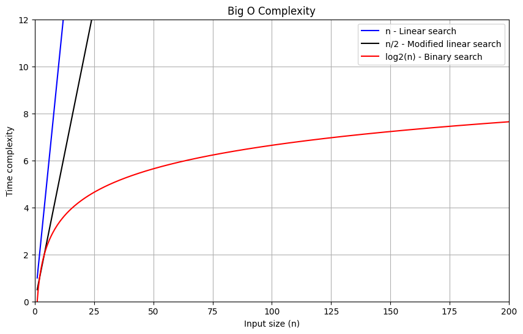

# Data Science Tools: Numpy, Pandas og Matplotlib: Intro til moduler

I dag tager vi hul på dataanalyse delen af dette valgfag. Vi starter med at lære 2 biblioteker at kende: **Numpy** og **Matplotlib**. Numpy er et akronym for "Numerical Python" og "Matplotlib" kunne vel tolkes som "Mathmatical Plotting Library" ( selvom det mere korrekt er "MATLAB plotting Library").

"Numerical" peger på at biblioteket bruges til tal og beregninger. Så numpy er et bibliotek til at arbejde med tal, Statistik, linier algebra mm.    
Matplotlib bibliotekets formål er at generere visuelle grafer og diagrammer, ofte baseret på det data man har arbejdet med i numpy og pandas.

## Læringsmål
* Kunne bruge biblioteket Numpy
* Have viden om biblioteket Pandas
* Kunne bruge biblioteket Matplotlib

## Forberedels
_(forberedelse til i dag er på omkring 3 timer)_    

Se først denne korte introduktion til hvad modulerne **Numpy** og **Pandas** er og hvad de bruges til:

* [NumPy vs Pandas](https://www.youtube.com/watch?v=KHoEbRH46Zk) (5:54)

Resten af denne uges sessioner bruger vi på **Numpy** og **Matplotlib**, mens **Pandas** er fokusområdet for næste uge. 

Gå nu videre med denne introduktion til Numpy:
* [Python NumPy Tutorial for Beginners](https://www.youtube.com/watch?v=QUT1VHiLmmI) (58:09)

Herefter skal du træne brugen af numpy vha. af følgende prompt.

> PROMPT: "I want to practice Python exercises focusing on the NumPy library. Each exercise should cover one of the following topics: creating a NumPy array, manipulating arrays, or applying mathematical operations on arrays.
> Please give me one exercise at a time. After I submit my solution, evaluate my answer, provide constructive feedback, and grade it on a scale of 1 to 10. Based on my performance, adjust the difficulty level of the next exercise to either be harder or easier."

Til sidst skal du se denne video om Matplotlib:

* [Matplotlib Tutorial: For Physicists, Engineers, and Mathematicians](https://www.youtube.com/watch?v=cTJBJH8hacc&list=PLkdGijFCNuVnGxo-1fSNcdHh5gZc17oRM) (47:59)

OBS: Han starter  med at beskrive et modul der skal installeres (SciencePlots). Det er ikke nødvendigt, så bare undlad dette. 

<!--
* [Intro to Data Visualization in Python with Matplotlib! (line graph, bar chart, title, labels, size)](https://www.youtube.com/watch?v=DAQNHzOcO5A) (32:32)
-->

## Dagen i dag

Vi kigger på hvordan man kan lave et plot som dette:

* Kode fra undervisningen kan i finde [her](../materialer/ses10/)

## Materialeliste
* [NumPy vs Pandas](https://www.youtube.com/watch?v=KHoEbRH46Zk)
* [Numpy dokumentation](https://numpy.org/doc/stable/user/absolute_beginners.html)
* [Matplotlib dokumentation](https://matplotlib.org/stable/)
* [Intro to Data Visualization in Python with Matplotlib! (line graph, bar chart, title, labels, size)](https://www.youtube.com/watch?v=DAQNHzOcO5A) (32:32)
* [Python NumPy Tutorial for Beginners](https://www.youtube.com/watch?v=QUT1VHiLmmI) (58:09)
* [NumPy Tutorial.ipynb](https://github.com/KeithGalli/NumPy/blob/master/NumPy%20Tutorial.ipynb)
* [Matplotlib Tutorial.ipynb](https://github.com/KeithGalli/matplotlib_tutorial/blob/master/Matplotlib%20Tutorial.ipynb)

<!-- 
* [NumPy Tutorial: Your First Steps Into Data Science in Python](https://realpython.com/numpy-tutorial/#hello-numpy-curving-test-grades-tutorial)
-->

### Øvelser
### 1. Billedmanipulation med numpy
* Brug `plt.imread()` og `plt.imshow()` og derefter numpy operationer til at manimulere med et billede. 
* Brug `from scipy.io import wavfile` og `wavfile.read('/Bongo_sound.wav')`

### 2. Lav disse plots
Du skal lave koden der generer disse plots. Kom så tæt på denne illustration som muligt. Når du er færdig kan du forsøge at forbedre plotenes udseende. 

(Tip: [brug dokumentationen for matplotlib](https://matplotlib.org/stable/plot_types/index.html))

### 3. Numpy, Matplotlib og linær regressions analyse
Start med at downloade disse fire filer fra et meget berømt dataset (i hvert tilfælde inden for Data Science miljøet):
* [Data 1](../assets/data1.tsv), [Data 2](../assets/data2.tsv), [Data 3](../assets/data3.tsv), og [Data 4](../assets/data4.tsv).    
Formatet er _.tsv_ og det står for _tab seperated values_. Hver fil har to kolonner (adskilt med tab-tegnet). Den første kolonne er x-værdier, og den anden kolonne er y-værdier.    

Det er ok at højreklikke på filerne og derefter sige ja til at downloade dem, men det er sjovere at bruge python til det. Men du bestemmer.     

**Og nu til selve øvelsen:**    

1. Brug `numpy` funktionen [`mean`](https://numpy.org/doc/stable/reference/generated/numpy.mean.html) til at beregne gennemsnittet af både x-værdier og y-værdier for hvert datasæt. For at formatere resultaterne med præcis 2 decimaler, skal du bruge Python f-string.
2. Beregn nu variansen for alle de forskellige sæt af x- og y-værdier ved at bruge `numpy` funktionen [`var`](https://numpy.org/doc/stable/reference/generated/numpy.var.html). Print det med tre decimaler.
3. Brug NumPy til at beregne [Pearsons korrelation](https://numpy.org/doc/stable/reference/generated/numpy.corrcoef.html) mellem x- og y-værdierne for alle fire datasæt. Print resultatet med tre decimaler.
4. Brug lineær regression til at finde en ret linje \( $f(x) = ax + b$ \) gennem hvert datasæt, og udskriv værdierne for \( $a$ \) og \( $b$ \)  
(med to decimalers præcision).
    * I vil godt kunne bruge numpy til at beregne dette, men biblioteket [Scipy](https://docs.scipy.org/doc/scipy-1.15.0/reference/generated/scipy.stats.linregress.html) har en lidt mere dirrekte metode til at beregne det. 
5. Plot de fire datasæt ved hjælp af matplotlib.pyplot. Lav et subplot med 2 rækker og 2 kolonner for at placere alle plots pænt i et gitter, og brug samme x- og y-område for alle fire plots. Inkluder den lineære regressions linie i alle fire plots. Sørg for at have beskrivelselser (labels) på x- og y-akserne og en title på hvert plot, så man kan se hvilke data du beskriver.

### Tutorials
Som det sidste skal i gennemgå disse 2 tutorials. Den ene om Numpy, den anden om Matplotlib. Jeg (Claus) har været igennem dele af materialet i mine gennemgange af stoffet i klassen, så i kan se det som en slags "opfrisker". Ud over det går begge tutorials lidt mere i dybden med begge biblioteker. 

* [NumPy Tutorial: Your First Steps Into Data Science in Python](https://realpython.com/numpy-tutorial/)
* [Python Plotting With Matplotlib (Guide)](https://realpython.com/python-matplotlib-guide/)
