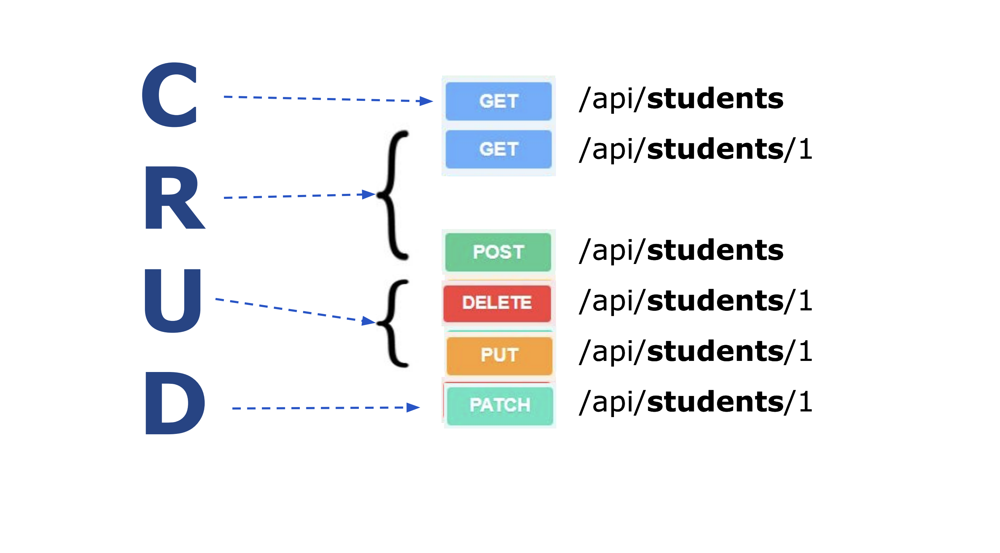

# Sidste uge med grundlæggende python
I denne uge er der ingen fysisk undervisning, men i skal læse en del materialer og se nogle videoer, og lave øvelser.
Så ugen er en selvstudie uge. Der er desuden en obligatorisk opgave forbundet med denne uge. Opgaven er meget enkel, du skal arbejde dig igennem ugens materiale, og efterfølgende give mig en binær besked om du har gjort det (eller ej). 


## Forløbet

Måden i kommer igennem materialet på er ved at starte her fra toppen af dokumentet, og så arbejde jer mod bunden. 

### Classes og Objects
Indtil nu (og faktisk også fremover) har vi arbejdet med python uden at skrive vores egne klasser. Det er dog en god ide at i har en forståelse for hvordan klasser og objekter fungerer i python, da i ofte bruger klasser som andre folk har lavet. 

Her er 2 resourcer som forklare jer det grundlæggende ved klasser og objekter i python. I vælger selv hvilken der passer jer bedst. 

* [Python Classes and Objects || Python Tutorial || Learn Python Programming](https://www.youtube.com/watch?v=apACNr7DC_s)
* [Python Classes: The Power of Object-Oriented Programming](https://realpython.com/python-classes/)

### Database: Sqllite
I python er det selvfølgelig muligt at interagerer med forskellige databaser. En ofte brugt en af typen er den som hedder Sqlite. Den følgende video er en beskrivelse af hvordan i bruger den.

* [SQLite in Python || Python Tutorial || Learn Python Programming](https://www.youtube.com/watch?v=c8yHTlrs9EA)(10:10)

Og python dokumentationen til denne type af databaser kan i se her:

* [sqlite3 — DB-API 2.0 interface for SQLite databases](https://docs.python.org/3/library/sqlite3.html)

### REST API med Flask
Det sidste emne denne uge er **REST API med Flask**. 
Flask er et web framework, ligesom det i kender fra tidligere: **Spring Boot**. Dog meget, meget mere simpelt i sin udformning. 

I kan få en kort introduktion til dette framework her:

* [Create A Python API in 12 Minutes](https://www.youtube.com/watch?v=zsYIw6RXjfM) (12:03)

Når i har set denne video skal i lave følgende øvelse:

#### Øvelse: Flask Memebers API
Kig på følgende diagram og opret et API med Flask der følger disse routes.



1. I stedet for så lave det med `students` skal i lave det med `members`. 
2. I skal som udgangspunkt læse [denne liste med dictionaries](https://github.com/ITAKEA/kode_fra_undervisning_e24/blob/master/flask1/data_dict.py) som jeres datakilde.
1. Når i har fået det til at virke skal Api´et gemme og læse data i en Sqlite database. Det skal være det samme data som i listen, så i skal `INSERT` det i en tabel i databasen (`executemany`) 
2. Hver Member skal altså have følgende attributter:

``` 
    id, (primær nøgle og skal auto incrementeres) 
    first_name, 
    last_name, 
    birth_date, 
    gender, 
    email, 
    phonenumber, 
    address, 
    nationality,
    active,
    github_username
``` 

3. I skal sørge for at de rigtige http statuskoder returneres med `http responset`.
4. Og Husk: der er regler for hvad der skal ske i et GET POST, PUT, PATCH og DELETE request. De regler skal i følge. Her er det helt ok at spørge en [LLM](https://chat.mistral.ai/chat) om disse regler, men sørg for at skrive koden selv!
5. I skal også sørge for at fange eventuelle fejl, som et forkert id, forkert json i body osv.


## Obligatorisk opgave
Når du er færdig med dette skal du skal du afkrydse på [Fronter](https://kea-fronter.itslearning.com/plans/courses/7061/plan/115819/element/1360507?BackDestination=0&BackData=%7B%22BackDestination%22%3A%220%22%2C%22planner2-sb-collapsed%22%3A%22false%22%7D&planner2-sb-collapsed=false)